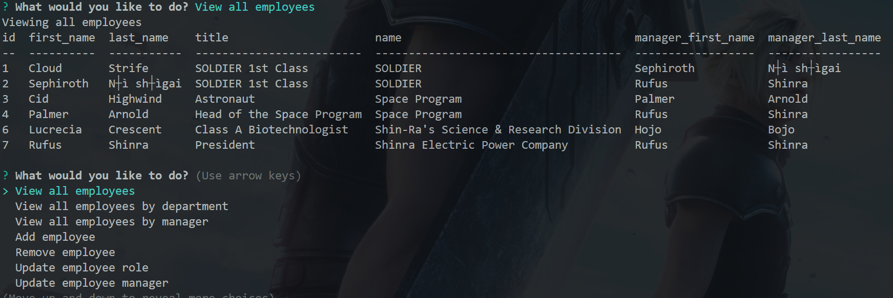

# Employee Management System

## Overview

[Watch the video!](https://www.youtube.com/watch?v=dpajkm4KwRY)




This Employee Management System is built using Node.js and utilizes the following modules:

- inquirer
- mysql2
- console.table
- dotenv 

The system connects to a MySQL database and provides the user with the ability to perform various tasks related to managing employees and their information, such as viewing all employees, viewing employees by department or manager, adding/removing employees, updating employee roles and managers, viewing roles, departments and budget utilization.

## Getting Started

1. Clone the repository
2. Run npm install to install the required dependencies
3. Create a .env file in the root directory and specify the following environment variables:
    - DB_HOST: the host of the MySQL database
    - DB_USER: the username to access the database
    - DB_PASS: the password for the username
    - DB_NAME: the name of the database
4. Run node index.js to start the system

## Usage

Usage
Once the system starts, the user is prompted to select from a list of actions to perform. The actions include:

- View all employees
- View all employees by department
- View all employees by manager
- Add employee
- Remove employee
- Update employee role
- Update employee manager
- View all roles
- Add role
- Remove role
- View all departments
- Add department
- Remove department
- View the total utilized budget of a department
- Exit

After selecting an action, the system performs the corresponding task and displays the results in a table. The user can then select another action to perform.

To run the application, you need to install the dependencies by running the following command in your terminal/command prompt:

```
npm install
```
Once the dependencies are installed, you can start the application by running the following command:

```
npm start
```

The application will prompt you with a list of options for you to choose from. From there, you can follow the instructions provided by the application to interact with the MySQL database.

## License
<br />

## Questions
<br /> 
Any questions?<br />

###### [GitHub](https://github.com/iskry)<br /> 
###### [Email](troydsparks@gmail.com)<br />

